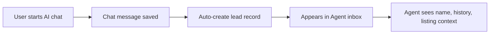

# Agent Portal for OwnIt Property Calculator

## Current Architecture Summary

- **Frontend**: Vanilla JS SPA with hash-based routing, rendered into `#app` in `index.html`. All pages live in the monolithic `assets/app.js` (~3500 lines).
- **Backend**: Node.js/Express with MongoDB Atlas. Routes in `backend/src/routes/` (auth, listings, chat, subscriptions, AI). JWT-based auth with no role system yet.
- **Database**: MongoDB Atlas (collections: `users`, `listings`, `subscriptions`, `chat_sessions`, `chat_messages`, `market_trends`, `saved_properties`, `agent_requests`).
- **Existing features**: User auth, property listings (100 seeded), AI chat, mortgage calculator, subscription system, market trends, AI valuation.

---

## Architecture Decisions

- **Agent role**: Add a `role` field to users (`"user"` | `"agent"`). Agents register/login through the same auth system but are routed to the agent portal.
- **Frontend structure**: Create a new `assets/agent-portal.js` file to keep the agent dashboard code separate from the consumer SPA. Add a new entry `agent.html` as the shell for the portal.
- **Backend**: Add new route files under `backend/src/routes/agent/` with an `requireAgent` middleware that checks `role === "agent"`.
- **Shared DB**: Reuse the existing MongoDB collections and add new ones for agent-specific data.

---

## New MongoDB Collections

- `leads` - tracks users who start chats (linked to chat_sessions, with stage pipeline)
- `appointments` - viewing requests and scheduling
- `agent_notes` - private notes attached to leads
- `discounts` - % or flat discounts applied to listings with expiry
- `documents` - file metadata for listing attachments (nice-to-have)
- `open_houses` - scheduled open house events (nice-to-have)
- `commissions` - private commission tracking (nice-to-have)

---

## Backend Implementation

### New Files

- [`backend/src/middleware/requireAgent.js`](backend/src/middleware/requireAgent.js) - Middleware that verifies JWT and checks `role === "agent"`
- [`backend/src/routes/agent/leadRoutes.js`](backend/src/routes/agent/leadRoutes.js) - Lead inbox and pipeline management
- [`backend/src/routes/agent/listingMgmtRoutes.js`](backend/src/routes/agent/listingMgmtRoutes.js) - Full CRUD for listings (add/edit/remove/mark sold)
- [`backend/src/routes/agent/discountRoutes.js`](backend/src/routes/agent/discountRoutes.js) - Apply/remove discounts and offers
- [`backend/src/routes/agent/chatRoutes.js`](backend/src/routes/agent/chatRoutes.js) - Real-time chat panel (agent responds as human)
- [`backend/src/routes/agent/appointmentRoutes.js`](backend/src/routes/agent/appointmentRoutes.js) - Appointment scheduler
- [`backend/src/routes/agent/analyticsRoutes.js`](backend/src/routes/agent/analyticsRoutes.js) - Listing performance and market comparison
- [`backend/src/routes/agent/calculatorRoutes.js`](backend/src/routes/agent/calculatorRoutes.js) - View client calculator runs

### Modifications to Existing Files

- [`backend/src/routes/authRoutes.js`](backend/src/routes/authRoutes.js) - Add `role` field to registration, include role in JWT payload
- [`backend/src/db/mongo.js`](backend/src/db/mongo.js) - Add new collection accessors and indexes
- [`backend/src/app.js`](backend/src/app.js) - Mount new `/api/agent/*` route groups

### Key API Endpoints

**Leads**
- `GET /api/agent/leads` - List all leads with filters (stage, date)
- `GET /api/agent/leads/:id` - Lead detail with chat history and calculator runs
- `PATCH /api/agent/leads/:id/stage` - Move lead through pipeline (New -> Contacted -> Viewing Scheduled -> Offer Made -> Closed)
- `POST /api/agent/leads/:id/notes` - Add private note
- `GET /api/agent/leads/:id/notes` - Get notes for a lead

**Listings Management**
- `POST /api/agent/listings` - Create listing
- `PUT /api/agent/listings/:id` - Update listing
- `DELETE /api/agent/listings/:id` - Remove listing
- `PATCH /api/agent/listings/:id/status` - Mark as sold/rented/active

**Discounts**
- `POST /api/agent/discounts` - Apply discount to listing
- `GET /api/agent/discounts` - List active discounts
- `DELETE /api/agent/discounts/:id` - Remove discount
- `PATCH /api/agent/listings/:id/price-flag` - Flag as "price reduced"

**Chat**
- `GET /api/agent/chats` - All active chat sessions
- `GET /api/agent/chats/:sessionId/messages` - Message history
- `POST /api/agent/chats/:sessionId/reply` - Send reply as agent (human)

**Appointments**
- `GET /api/agent/appointments` - Calendar view data
- `POST /api/agent/appointments` - Create appointment
- `PATCH /api/agent/appointments/:id` - Update/confirm/cancel

**Analytics**
- `GET /api/agent/analytics/listings` - Views, saves, calculator runs per listing
- `GET /api/agent/analytics/market-comparison?listingId=` - Compare price/sqft vs market trends
- `GET /api/agent/analytics/subscribers` - Users by subscription tier

**Calculator View**
- `GET /api/agent/calculator-runs` - All calculator runs by users (with listing context)

---

## Frontend Implementation

### New Files

- [`agent.html`](agent.html) - Agent portal shell (similar structure to `index.html` but with agent-specific nav)
- [`assets/agent-portal.js`](assets/agent-portal.js) - Agent SPA entry point with its own router
- [`assets/agent-portal.css`](assets/agent-portal.css) - Agent-specific styles (dashboard layout, tables, pipeline board)

### Agent Portal Routes (hash-based)

| Route | Page |
|-------|------|
| `#/` | Dashboard overview (lead count, active chats, upcoming appointments) |
| `#/leads` | Lead inbox with pipeline kanban/list view |
| `#/leads/:id` | Lead detail (chat history, calculator runs, notes) |
| `#/listings` | Listing manager with CRUD |
| `#/listings/new` | Add new listing form |
| `#/listings/:id/edit` | Edit listing form |
| `#/chats` | Active chat panel |
| `#/appointments` | Appointment calendar |
| `#/analytics` | Performance dashboards |
| `#/settings` | Agent profile settings |

### UI Components

- **Dashboard**: Summary cards (new leads, active chats, upcoming viewings, listings count)
- **Lead Pipeline**: Kanban board with drag-and-drop stages or a filterable list view
- **Listing Manager**: Table with inline edit, status toggles, discount badges, photo upload placeholder
- **Chat Panel**: Split view with conversation list on left, active chat on right
- **Appointment Calendar**: Monthly calendar grid with appointment slots
- **Analytics**: Charts using the existing Chart.js library for listing performance and market comparison

---

## Data Flow: Lead Auto-Creation

When a user sends their first chat message, a lead record is automatically created in the `leads` collection with:
- `user_id`, `user_name`, `user_email`
- `source_listing_id` (if chat was triggered from a listing page)
- `stage: "new"`
- `created_at`

---

## Implementation Priority

**Phase 1 - Core (must-haves)**
1. Agent role system + auth
2. Lead inbox + pipeline
3. Listing manager (CRUD)
4. Discount/offer tools
5. Client calculator view

**Phase 2 - Engagement**
6. Active chat panel (human replies)
7. Appointment scheduler
8. Notes per client
9. Status pipeline (kanban UI)

**Phase 3 - Analytics**
10. Listing performance metrics
11. Market comparison tool
12. Subscription tier visibility

**Phase 4 - Nice-to-haves**
13. Document uploads
14. Open house scheduler
15. Commission tracker
